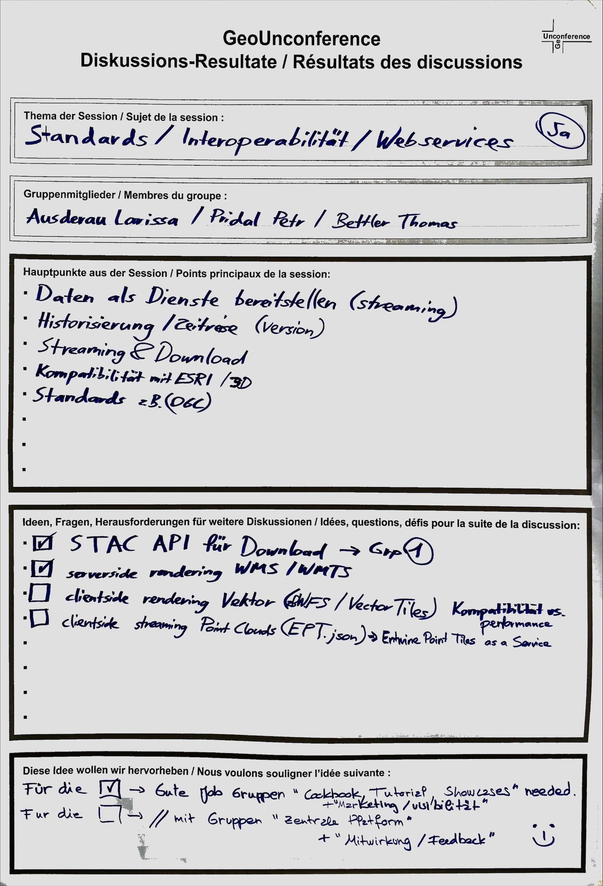

**Navigation**

- [Die GeoUnconference / La GeoUnconference](https://geounconference.github.io/geounconference)
- **Resultate der GeoUnconference #1 / Résultats de la GeoUnconference #1**
- [Diskussionen zur GeoUnconference / Discussion atour de la GeoUnconference](https://github.com/GeoUnconference/discussions/discussions) 
- [Registrierung für Anlässe / Inscription aux évènements)](https://ti.to/geounconference)

# Resultate der GeoUnconference #1 vom 24.06.2021 / Résultats de la GeoUnconference #1 du 24.06.2021

*[En français ci-dessous](#francais)*

Die GeoUnconference ist eine Serie von Unconferences zu den Geodaten von Schweizer Behörden auf Ebene Bund, Kantone und Gemeinden. Auf dieser Seite sammeln wir die **Resultate der GeoUnconference #1, die am 24.06.2021 in Bern stattgefunden hat**. Unser Motto für die GeoUnconference ist: Verbesserung von Zugang und Nutzung von Geodaten der Schweizer Behörden. An der GeoUnconference diskutieren wir während sogenannten Sessions in Gruppen unsere Ideen, wie wir diese Verbesserung erreichen können.

An der GeoUnconference #1 haben sich 9 Gruppen zu selbstgewählten Themen gebildet. Wegen der Corona-Schutzmassnahmen wurden einige Themen wurden von mehreren Gruppen parallel bearbeitet (damit die Gruppen nicht zu gross werden). Zusätzlich haben wir uns Gedanken zu Stärken und Schwächen der Nationalen Geodateninfrastruktur (NGDI) gemacht und überlegt, was die NGDI für uns überhaupt ausmacht.

**Die Resultate der Gruppendiskussionen (in Form von Wrap-Up-Postern) sowie die Einschätzungen zur NGDI stellen wir hier zur Verfügung.**

Inhaltsverzeichnis:

- [Unser Verständnis der NGDI sowie ihrer Stärken und Schwächen](#ngdi)
- [Gruppe «Zugang zu Geodaten via zentrale Plattform»](#access-1)
- [Gruppe «Zugang zu Geodaten»](#access-2)
- [Gruppe «Cookbooks, Tutorials und Showcases für die Nutzung von Geodaten»](#cookbooks)
- [Gruppe «Feedback-Loop für Geodaten»](#feedback)
- [Gruppe «Marketing und Visibilität für amtliche Geodaten»](#marketing)
- [Gruppe «Standards, Interoperabilität und Webservices»](#standards)
- [Gruppe «Verkehr und Mobilität»](#traffic)
- [Gruppe Web-GIS, OGC und Tiles»](#standards-2)
- [Fragen und Kontakt](#contact)

*<a name="francais"/>En français*

La GeoUnconference est une série d'unconférences sur les géodonnées des autorités suisses au niveau fédéral, cantonal et communal. Sur cette page nous recueillons les **résultats de la GeoUnconference #1, qui a eu lieu le 24.06.2021 à Berne**. Notre devise pour la GeoUnconference est : Améliorer l'accès aux géodonnées des autorités suisses et leur utilisation. Lors de la GeoUnconference, nous discutons en groupes, au cours de sessions, de nos idées sur la manière de réaliser cette amélioration.

Lors de la GeoUnconference #1, 9 groupes se sont formés sur des sujets auto-sélectionnés. En raison des mesures de protection contre les effets corona, certains sujets ont été traités par plusieurs groupes en parallèle (afin que les groupes ne deviennent pas trop grands). En outre, nous avons réfléchi aux forces et aux faiblesses de l'l’Infrastructure nationale de données géographiques (INDG) et à ce que représente l'INDG pour nous.

**Les résultats des discussions de groupe (sous forme de posters récapitulatifs) et les évaluations de l’INDG sont disponibles ici.**

Table des matières :

- [Notre compréhension de l'INDG et de ses avantages et désavantages](#ngdi)
- [Groupe « Accès aux géodonnées via une plateforme centrale »](#access-1)
- [Groupe « Accès aux géodonnées »](#access-2)
- [Groupe « Livres de recettes, tutoriels et vitrines pour l'utilisation des géodonnées »](#cookbooks)
- [Groupe « Circuit de feedback pour les géodonnées »](#feedback)
- [Groupe « Publicité et visibilité pour les géodonnées officielles »](#marketing)
- [Groupe « Normes, interopérabilité et services web »](#standards)
- [Groupe « Transport et mobilité »](#traffic)
- [Groupe « Web-SIG, OGC et tuiles »](#standards-2)
- [Questions et contact](#contact)

## <a name="ngdi"/>Unser Verständnis der NGDI sowie ihrer Stärken und Schwächen / Notre compréhension de l'INDG et de ses avantages et désavantages

## <a name="access-1"/>Gruppe «Zugang zu Geodaten via zentrale Plattform» / Groupe « Accès aux géodonnées via une plateforme centrale »

[.jpg)](Access to geodata (2).jpg)

## <a name="access-2"/>Gruppe «Zugang zu Geodaten» / Groupe « Accès aux géodonnées »

## <a name="cookbooks"/>Gruppe «Cookbooks, Tutorials und Showcases für die Nutzung von Geodaten» /  Groupe « Livres de recettes, tutoriels et vitrines pour l'utilisation des géodonnées »

## <a name="feedback"/>Gruppe «Feedback-Loop für Geodaten» / Groupe « Circuit de feedback pour les géodonnées »

## <a name="marketing"/>Gruppe «Marketing und Visibilität für amtliche Geodaten» / Groupe « Publicité et visibilité pour les géodonnées officielles »

## <a name="standards"/>Gruppe «Standards, Interoperabilität und Webservices» / Groupe « Normes, interopérabilité et services web »

## <a name="traffic"/>Gruppe «Verkehr und Mobilität» / Groupe « Transport et mobilité »

[.jpg)](Traffic and mobility (2).jpg)

## <a name="standards-2"/>Gruppe Web-GIS, OGC und Tiles» / Groupe « Web-SIG, OGC et tuiles »

## <a name="contact"/>Fragen und Kontakt / Questions et contact

*En français ci-dessous*

Organisiert werden die GeoUnconferences von **Ralph Straumann** und **Anne Wegmann** von [EBP](https://www.ebp.ch), zusammen mit unserem Projektpartner **Stefan Ziegler**, [Kantonsgeometer von Solothurn](https://so.ch/verwaltung/bau-und-justizdepartement/amt-fuer-geoinformation/ueber-uns), und mit **David Oesch** von [swisstopo KOGIS](https://www.swisstopo.admin.ch/de/swisstopo/organisation/kogis.html). 

Das Projekt wird finanziert aus den [Zweckgebundenen NGDI-Mitteln](https://www.geo.admin.ch/de/ueber-geo-admin/leistungsauftrag/zweckgebundene-ngdi-mittel.html) und gesteuert durch das [Steuerungsorgan Zweckgebundene NGDI-Mittel](https://www.geo.admin.ch/de/ueber-geo-admin/leistungsauftrag/zweckgebundene-ngdi-mittel.html) mit Vertretenden von [swisstopo KOGIS](https://www.swisstopo.admin.ch/de/swisstopo/organisation/kogis.html) und [KGK](https://kgk-cgc.ch).

Wir informieren über die Anmeldung zu den Unconferences per Newsletter und auf Twitter:

- [Newsletter-Anmeldung](http://eepurl.com/ht_KRn)
- [GeoUnconference auf Twitter](https://www.twitter.com/geounconference)

**Bei Fragen kontaktiere bitte das GeoUnconference-Team unter <a href="mailto:unconference@ebp.ch">unconference@ebp.ch</a>.**

*En français*

Les GeoUnconferences sont organisées par **Ralph Straumann** et **Anne Wegmann** d'[EBP](https://www.ebp.ch), avec notre partenaire de projet **Stefan Ziegler**, [géomètre cantonal de Soleure](https://so.ch/verwaltung/bau-und-justizdepartement/amt-fuer-geoinformation/ueber-uns/), et avec **David Oesch** de [swisstopo COSIG](https://www.swisstopo.admin.ch/fr/swisstopo/organisation/cosig.html).

Le projet est financé par les [Moyens dédiés à l’INDG](https://www.geo.admin.ch/fr/geo-admin-ch/mandat-de-prestations/moyens-dedies-indg.html) et piloté par l'[Organe de Pilotage des Moyens dédiés à l’INDG](https://www.geo.admin.ch/fr/geo-admin-ch/mandat-de-prestations/moyens-dedies-indg.html) avec des représentants de [swisstopo COSIG](https://www.swisstopo.admin.ch/fr/swisstopo/organisation/cosig.html) et de la [CGC](https://kgk-cgc.ch/).

Nous informons des dates des unconferences et de l'inscription par une newsletter et sur Twitter :

- [Inscription à la newsletter](http://eepurl.com/ht_KRn)
- [GeoUnconference sur Twitter](https://www.twitter.com/geounconference)

**Si vous avez des questions, veuillez contacter l'équipe de la GeoUnconference à <a href="mailto:unconference@ebp.ch">unconference@ebp.ch</a>**